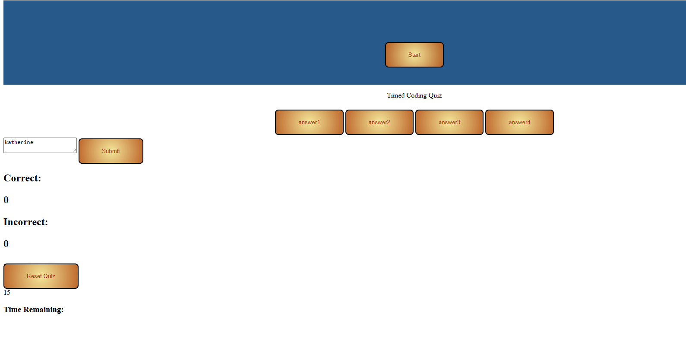

## Name
Timed Coding Quiz

## Description
Take this 3 questioned timed coding quiz. The page will display 3 questions where you have 15 seconds to answer the three. You will then be able to enter you initlas and score to save your results.

## Visuals
Depending on what you are making, it can be a good idea to include screenshots or even a video (you'll frequently see GIFs rather than actual videos). Tools like ttygif can help, but check out Asciinema for a more sophisticated method.

## Pictures
Below is an image of the application!

## Link
[website link](https://reinerkp.github.io/Timed-Quiz/)

